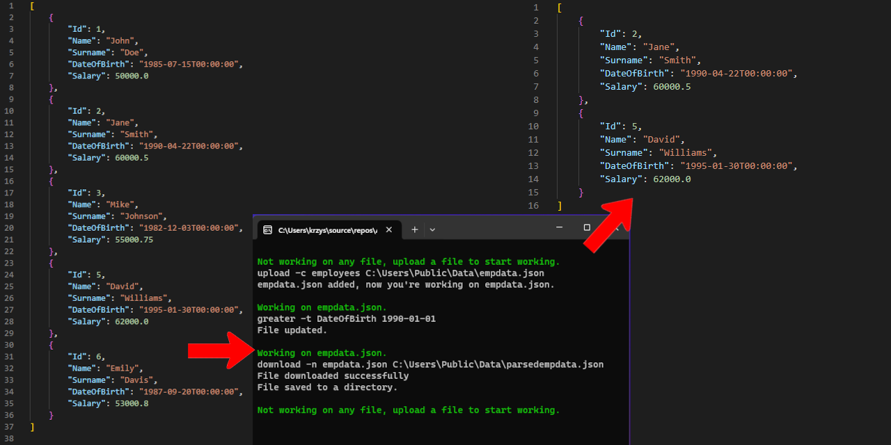
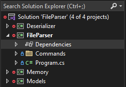
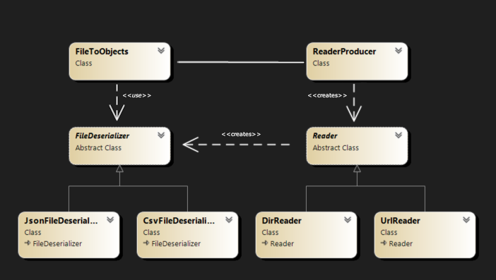
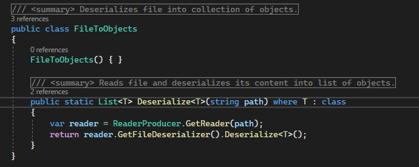

# About The Project
FileParser is a command-line utility designed for data management and processing. It empowers users to  load structured data files, such as JSON or CSV, 
into memory and execute data manipulation tasks with supported commands. This application supports concurrent loading of multiple files, offering users 
the ability to switch between datasets during the processing workflow.
# Getting Started
### Downloading the source code
You can download the source code for this application by clicking the "Clone or download" button on the GitHub repository page and then selecting 
"Download ZIP." Extract the contents of the ZIP file to a location of your choice.
### Building the Application
1. Run the following command to restore the NuGet packages:
```
dotnet restore
```
2. Run the following command to build the application:
```
dotnet build
```
### Running the Application
4. Open a command prompt or terminal window and navigate to the directory where you extracted the source code.
5. Run the following command to start the application:
``` 
dotnet run
```
The application should now be running, to use the application follow the ons-screen instructions or type --help.
# Usage
### User Interface
Applications supports various commands:     
**upload**
```
upload [-collection | --c] <collection_name> <source>
```
Upload commad uploads file from **source**, which is a URL or dir path into a memory, 
data stored in file must match given **collection_name** supported by the application.  
**download**
```
download [-name | --n] <name> <path>
```
Downloads file from the memory, **name** is file name that has been uploaded,
**path** is a directory path you want the file to be downlaoded.  
**greater**
```
greater [-than | --t] <property_name> <value>
```
Greater command parses a file you're currently working on,
and filters it by comparing **property_name** to a **value**,
returning objects with greater property values.  
**smaller**
```
smaller [-than | --t] <property_name> <value>
```
Smaller command parses a file you're currently working on,
and filters it by comparing **property_name** to a **value**, 
returning objects with smaller property values.  
**switch**
```
switch [-name | --n] <file_name> 
```
Switches a working directory into a directory
specified by a **file_name**.  
  
--help - displays help menu  
--exit - exits the application   

For example, user can upload a json file containing data about employees, filter it by the date of birth and download parsed file into a directory.  


# Code
### Architecture
The application architecture is built upon three projects, each representing independent services that operate autonomously and don't depend on each other.
2. The startup project designed for streamlined execution, incorporates console commands with help of CommandLineParser nuget package and parses data
with use of those services.  


### Deserializer service
The Deserializer service employs the **abstract factory** design pattern to determine file paths and types,  transforming their contents into well-structured objects.
The application is further refined through the application of the **facade** design pattern. This approach encapsulates the entire service within two publicly accessible classes, 
effectively abstracting all underlying complexity from end-users.  <br /> 
  
<br />
Endpoint class providing access to serializer.  
<br />



# Contributing
If you wish to contribute to this project, please feel free to create a pull request with your changes.
# License
This project is licensed under the MIT License - see the LICENSE file for details.

